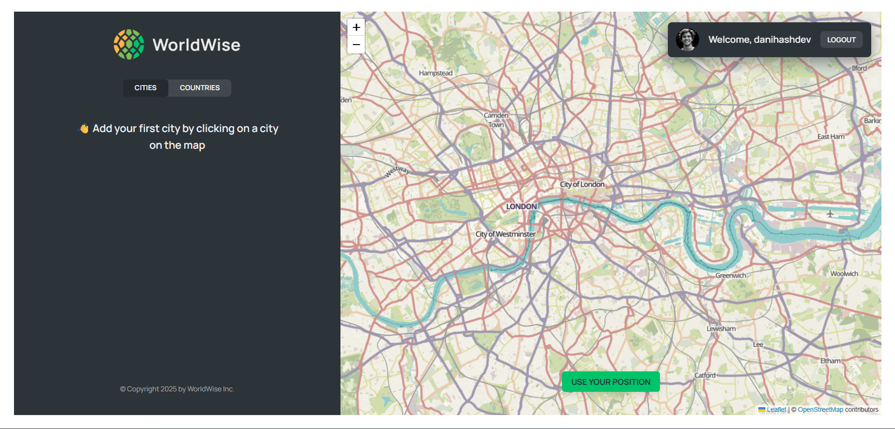
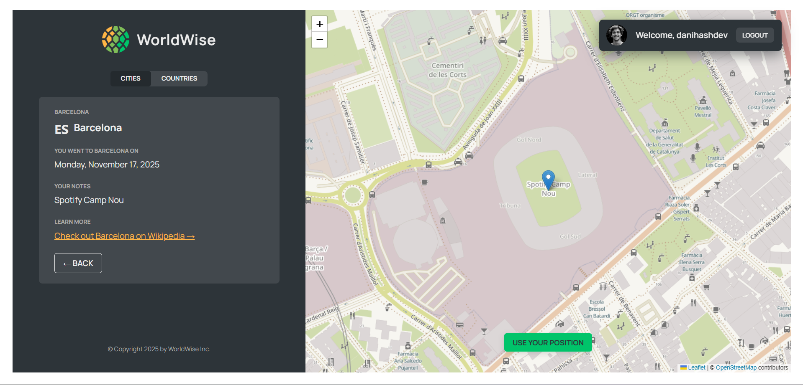

# 🌍 WorldWise

  
_A modern, interactive city & country exploration tool built with React, Leaflet, and CSS Modules._

---

## 🚀 About WorldWise

**WorldWise** is an interactive web application that lets users explore cities and countries on a dynamic map, view detailed city information, and manage their favorite locations.

Key highlights:

- Real-time geolocation to find your current position.
- Interactive map with clickable cities and countries using **React-Leaflet**.
- Fully dynamic city and country lists with CRUD functionality.
- Authentication-protected routes for personalized user experiences.
- Component-level styling with **CSS Modules** for scoped, maintainable CSS.

---

## 🎨 Features

- **Interactive Map**: Pan, zoom, and click on the map to add new locations.
- **City Management**: Add, delete, and view detailed information about cities.
- **Authentication**: Login & protected routes for personalized access.
- **Responsive Design**: Optimized for desktop and mobile.
- **Modern Tech Stack**: Built with React 19, Vite, React Router 7, and Leaflet.
- **Scoped Styling**: CSS Modules used for clean, conflict-free styles.

---

## 🛠 Tech Stack

**Frontend**

- React 19 & React Router 7
- React-Leaflet & Leaflet
- React DatePicker
- **CSS Modules** for component-level styling
- Google Fonts (Manrope)

**Backend / API**

- `json-server` for local API mocking
- RESTful endpoints for cities and countries

**Development Tools**

- Vite for fast bundling
- ESLint with plugins for React & hooks
- Lazy-loaded components with suspense fallback

---

## 📸 Screenshots / Preview

**Map View**  


**City Details**  


---

## ⚡ Getting Started

### Prerequisites

- Node.js v20+
- npm or yarn

### Installation


```bash
git clone https://github.com/yourusername/worldwise.git
cd worldwise

npm install
# or
yarn install

npm run server   # Start JSON server on port 8000
npm run dev      # Start Vite dev server

```
